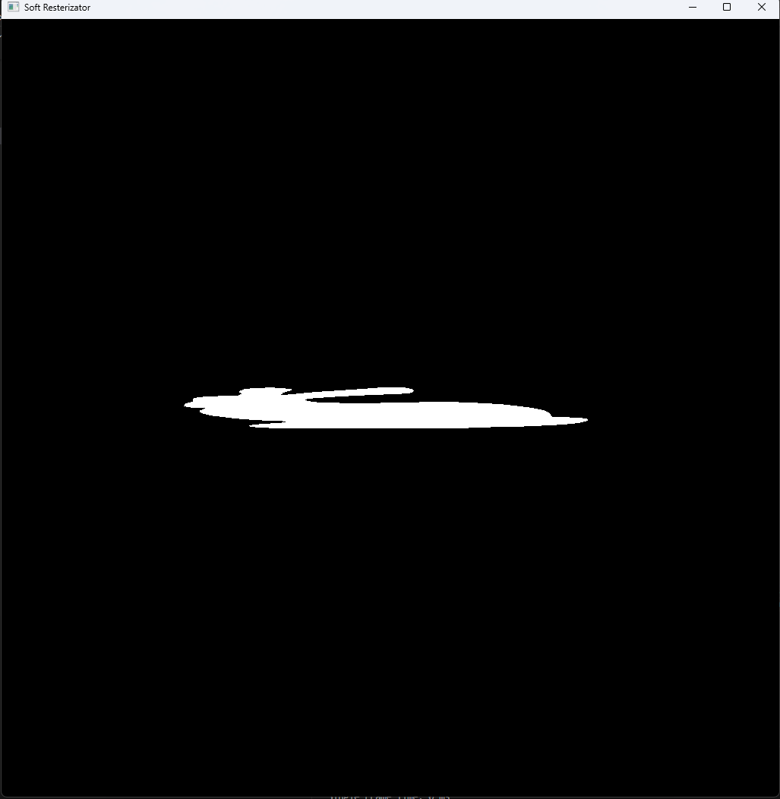

# Light Soft-Resterizator（软光栅渲染器）

This project uses simple functions of FreeGLUT to draw a single point on the canvas, while performing other calculations on the CPU. It is aimed at learning how to create a software rasterizer.

[gitea project repo](https://git.zhywyt.me/Rendering/softResterizator.git)
[github project repo](https://github.com/Dion6850/softRasterizator.git)

## Quick Start

You should change the `<path to your vcpkg root>` to the real path.

```cmd
git submodule init
git submodule update
vcpkg install freeglut
cmake -B build -DOOLCHAIN_FILE=<path to your vcpkg root>/scripts/buildsystems/vcpkg.cmake
cmake --build build 
```

Just like this:

```cmd
cmake --B build -DCMAKE_TOOLCHAIN_FILE=D:/vcpkg/scripts/buildsystems/vcpkg.cmake
```

## Error Version Info

**There is a error version, you can build with this result:**



**There is a bunny crashed by some mistery power such as `error project matrix`. OK It's just a joke, but i want save this ineresting error version named `crashedBunny`.**

## Project tree

```bash
|-- CMakeLists.txt
|-- README.md
|-- Lsr3D
|   |-- include
|   |   |-- core
|   |   |-- utils
|   |   `-- test
|   |-- src
|   |   |-- core
|   |   `-- utils
|   `-- CMakeLists.txt
|-- main.cpp
|-- thirdPart
|   `-- eigen
|   `-- stb

```

## code format

C++ format vscode setting file:

```json
"C_Cpp.vcFormat.newLine.beforeElse": false,
"C_Cpp.vcFormat.newLine.beforeCatch": false,
"C_Cpp.vcFormat.newLine.beforeOpenBrace.block": "sameLine",
"C_Cpp.vcFormat.newLine.beforeOpenBrace.function": "sameLine",
"C_Cpp.vcFormat.newLine.beforeOpenBrace.lambda": "sameLine",
"C_Cpp.vcFormat.newLine.beforeOpenBrace.namespace": "newLine",
"C_Cpp.vcFormat.newLine.beforeOpenBrace.type": "sameLine",
"C_Cpp.formatting": "vcFormat"
```
